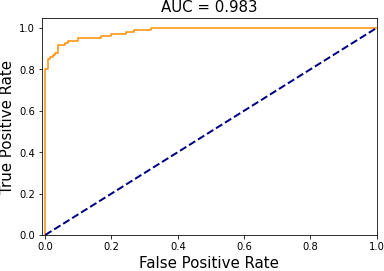

[](https://dataroots.io)

# Face Mask Detection
Face masks are crucial in minimizing the propagation of Covid-19, and are highly recommended or even obligatory in many situations. In this project, we develop a pipeline to detect unmasked faces in images. This can, for example, be used to alert people that do not wear a mask when entering a building.

Our pipeline consists of three steps:
  1. We detect all human faces in an image
  2. We make a mask/no_mask prediction for each of them
  3. We return an annotated image with the predictions


## General Model Workflow


### Technologies
* Python
* Tensorflow/keras

### Data collection
Our training data is based on the [VGGFace2 dataset](http://www.robots.ox.ac.uk/~vgg/data/vgg_face2/). This dataset provides a collection of faces that are captured in the wild with different ethnicities, ages and emotions. We use 4941 images of this dataset, and apply an artificial masks to half of them. This data will be used to train our mask/no_mask classifier.

Our validation and testing data consists of images of people with and without masks that we collected from various sources that provide images with permissive licences (e.g. [pexels.com](www.pexels.com), [unsplash.com](www.unsplash.com)). We have manually annotated all faces in the collected images, and labeled them as being masked or not (using the [makesense.ai](https://www.makesense.ai/) annotation tool). We collected 273 images which contain 524 faces (many images contain multiple faces). 246 faces are masked and 278 are non-masked. These faces are split 50/50 over the validation set and test set. An overview of the collected data and corresponding URLs and ground truth annotations can be found in [test_validation_metadata.csv](data/test_validation_metadata.csv).

### Data preprocessing
Labeled data of masked faces is hard to come by, which is why we decided to set the overall still limited set of real masked faces that we have collected apart for validation and testing. Artificially generated masks that are used for training are generated as follows:

  1. Detect the face in the image
  2. Find the face landmarks, more specifically we need the location of the nose and chin
  3. Apply an image of a mask to the face with the position based on the face landmarks

This strategy is based on the description that you can find in the [prajnasb/observations repository](https://github.com/prajnasb/observations).
We apply 13 masks with different shapes and colors to generate training data, which you can find in [data/mask-templates](data/mask-templates). Below you can see an example of a mask being artificially applied.


### Face Detection
We used the RetinaFace face detector to extract faces as it is the state-of-the-art in face localisation in the wild, and works in real-time on a single CPU core [(Deng et al.)](https://arxiv.org/abs/1905.00641). We used the implementation and pre-trained model available at the [retinaface-tf2 repository](https://github.com/peteryuX/retinaface-tf2).

### Masked or Not Masked Classification
The model that we train to distinguish between masked and non-masked cropped faces consists of a MobileNetV1 base followed by 1 fully connected layer and a final output layer with sigmoid activation. We use ImageNet pre-trained weights for the MobileNetV1 base, and only finetune the final 4 layers of the complete model. Only VGGFace2 non-masked and artificially masked data is used for training. We use two validation sets:
  1. One consisting of VGGFace2 non-masked and artificially masked data
  2. One consisting of real masked and unmasked faces from the set that we have collected ourselves.

This allows us to keep track of performance on artificial and real data separately. The final test set evaluation is only performed on **real data**.

### Model Performance

#### Overall evaluation

Our test set of 135 images contains 254 faces, of which 136 are unmasked.

The following table summarizes the performance of the complete pipeline (i.e. the face detector followed by the classifier).  
We consider a face to be identified if the face detector produces a bounding box with an intersection over union (IoU) > 0.5 with the ground truth bounding box corresponding to that face.

The two most relevant metrics are the true negative rate (TNR) and the false negative rate (FNR). The first one tells us how many of the unmasked faces we detect, and the second one how many times we incorrectly identify an unmasked face.

128 of the 136 unmasked faces were identified correctly, resulting in a **true negative rate (TNR) of 94%**. 20 of the 118 masked faces were incorrectly identified as unmasked, resulting in a **false negative rate (FNR) of 15.7%**.


|    |      ground truth      |  identified and classified correctly | identified but classified wrongly | not identified by detector |
|----------|:-------------:|------:| ------:|------:|
| masked faces |  127 |  97 | 20 | 10 |
| unmasked faces |    136   |   128 | 3 | 5  |

The pipeline also incorrectly identified 6 faces that did not match any face in the ground truth, 5 of them were subsequently classified as non-masked and 1 as masked.


#### Evaluation of the face detector

The face detector correctly identifies 94% of the ground truth faces in the test set (i.e. for 239 out of 254 ground truth bounding boxes there is a predicted bounding box with an IoU > 0.5). Of the 15 faces in the ground truth that it does not detect, 10 are masked and 5 are not masked. This means that 5 out of the 8 missed unmasked faces were due to the detector. The face detector also outputs 6 bounding boxes for the test set that do not correspond to faces, 5 of which were subsequently classified as masked.

#### Evaluation of the mask/no mask classifier

The mask/no mask classifier was evaluated on the faces that were correctly identified by the face detector. The inputs to the classifier were the crops corresponding to faces identified by the face detector. With a classification threshold at 0.5, this resulted in the confusion matrix given in columns 3 and 4 (identified and classified correcly, and identified but classified wrongly) of the table above. Of course we can easily trade off between TNR and FNR by changing the classification threshold. The following figure shows the ROC curve for the mask/no mask classifier.




## Getting Started
1. To clone this repository, run `git clone --recursive https://github.com/datarootsio/face-mask-detection.git`. Note that if you don't use `--recursive` argument,
you cannot clone submodule [retinaface-tf2](https://github.com/peteryuX/retinaface-tf2).
2. Change current directory into cloned project by typing `cd face-mask-detection`.
3. You need to extract `data.tar.gz`. You can either type `tar xvfz data.tar.gz` or browse to `ROOT` directory of the project and double click on `data.tar.gz` for mac users.

Extracted data folder should look like this:
```
data
├── classifier_model_weights   # The pre-trained classifier model weights
├── mask-templates # Template mask images to artificially create masked faces
├── raw_images # Raw images to generate validation/test set
├── sampled_face_images # Sampled face images from VGGFace2 dataset
├── test # Test set to evaluate mask classifier model
│   ├── masked
│   └── not_masked
├── train # Train set to train mask classifier model
│   ├── masked
│   └── not_masked
└── validation # validation set to train validation classifier model
    ├── artificial
    │   ├── masked
    │   └── not_masked
    └── real
        ├── masked
        └── not_masked
```

4. If you don't want to reproduce this repository and want to use pretrained weights go to step 9.
5. To reproduce `train/validation/test sets` from scratch, run `scripts/prep-data.ipynb` notebook.
6. To retrain the `masked or not masked classifier` model, run `scripts/train_mask_nomask.ipynb` notebook.
7. To evaluate the trained model and get overall performance of mask detection algorithm, run `scripts/evaluate_pipeline.ipynb` notebook.
8. To evaluate the performance of `RetinaFace` model, run `scripts/face_detection.ipynb` model.
9. Run `predict.ipynb` to run entire pipeline and see an example output of face mask detection model.
10. To deploy this repository in [dploy.ai](http://www.dploy.ai),

## Contact
[Do you have any questions?](https://dataroots.io/contact)

## TODO

- Refactoring/cleaning train_mask_nomask.ipynb
- Generating ROC curve for overall pipeline
