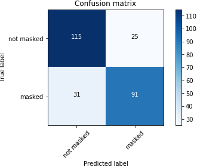

# Face Mask Detection
The general outline of the model

The purpose of this project is ________. (Describe the main goals of the project and potential civic impact. Limit to a short paragraph, 3-6 Sentences)

## General Model Workflow

### Methods Used
* Face Detection
* Image Classification

### Technologies
* Python
* Tensorflow

## Project Description
(Provide more detailed overview of the project.  Talk a bit about your data sources and what questions and hypothesis you are exploring. What specific data analysis/visualization and modelling work are you using to solve the problem? What blockers and challenges are you facing?  Feel free to number or bullet point things here)

### Data collection
Give more details about datasets and where do we collect

### Data preprocessing
Explain the steps that are done to generate our training set like artificial mask generation

### Face Detection
Give more insights about [retinaface](https://github.com/peteryuX/retinaface-tf2) model. Why we used this? Refer to paper

### Masked or Not Masked Classification
Explain how we fine tuned the mobilenet convnet. Why we used mobilenet?

### Model Performance

#### Overall evaluation

Our test set of 135 images contains 254 faces, of which 136 are unmasked.

128 of the 136 unmasked faces were identified correctly, resulting in a **true negative rate (TNR) of 94%**.\
We consider an unmasked face to be identified correctly if the detector produces a face bounding box that has an intersection over union (IoU) > 0.5 with the ground truth bounding box for that face, and the classification model subsequently classifies the detected face as unmasked.  

20 of the 118 masked faces were incorrectly identified as unmasked, resulting in a **false negative rate (FNR) of 15.7%**.

The pipeline incorrectly marked 5 masked faces for which there was no matching face in the ground truth.

#### Evaluation of the face detector

The face detector correctly identifies 94% of the ground truth faces in the test set (i.e. for 239 out of 254 ground truth bounding boxes there is a predicted bounding box with an IoU > 0.5). Of the 15 faces in the ground truth that it does not detect, 10 are masked and 5 are not masked. This means that 5 out of the 8 missed unmasked faces were due to the detector. \
The face detector also outputs 6 bounding boxes for the test set that do not correspond to faces, 5 of which were subsequently classified as masked.

#### Evaluation of the mask/no mask classifier

The mask/no mask classifier was evaluated on the faces that were correctly identified by the face detector. The inputs to the classifier were the crops corresponding to faces identified by the face detector. This resulted in the following confusion matrix and ROC curve.

## Getting Started
Inform how to run this model on dploy.ai

#### Members:

|Name     |  Slack Handle   |
|---------|-----------------|
|[Full Name](https://github.com/[github handle])| @johnDoe        |
|[Full Name](https://github.com/[github handle]) |     @janeDoe    |

## Contact
* Dataroots contact details
